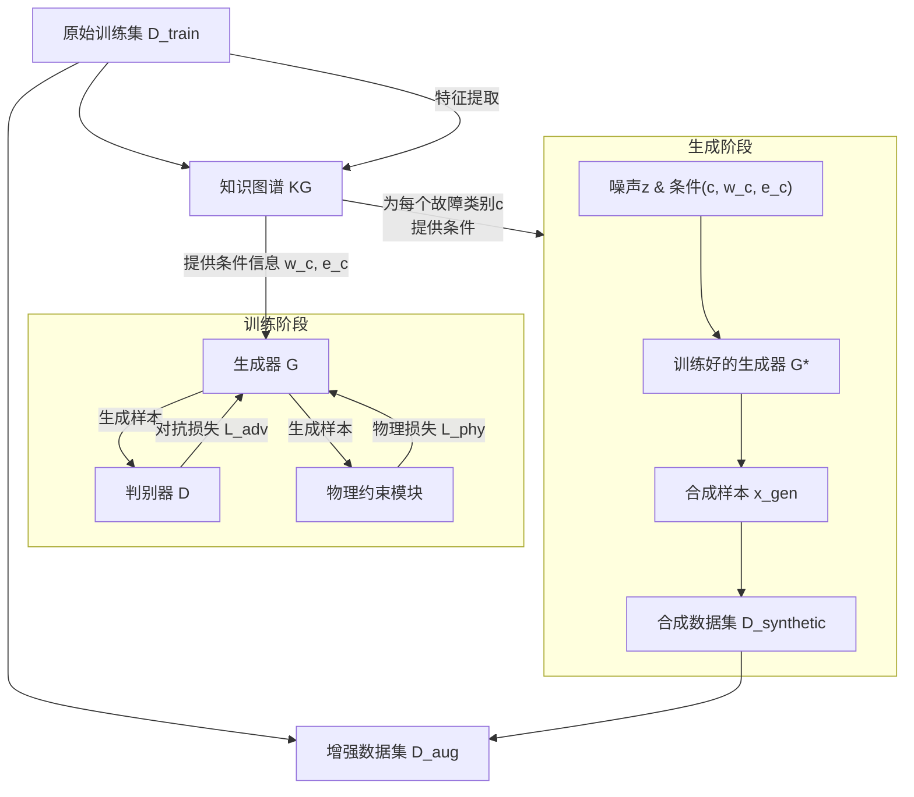

**2. Physics-Constrained Generative Augmentation（物理约束生成增强）** 部分进行详尽的阐释和细化，确保与第一部分的变量和物理意义保持高度一致。

---

### **2. Physics-Constrained Generative Augmentation（物理约束生成增强）**

本节核心目标是解决少样本学习中的核心难题——数据稀缺。通过引入**知识图谱（KG）** 中封装的可解释物理规律作为强约束，来指导生成对抗网络（GAN）的生成过程。这确保了生成的样本不仅在统计意义上“以假乱真”，更在物理本质上“合理可信”，从而实现高质量、高多样性的数据扩充。

该过程分为三个核心步骤：**2.1 生成器架构**、**2.2 物理约束**和**2.3 对抗训练**。

---

### **2.1 Generator Architecture (生成器架构)**

**目的**：设计一个条件生成器，其输入不仅包含随机噪声，更关键的是融入了来自知识图谱的物理知识（故障类型、特征权重、能量分布），从而引导生成过程，确保生成的样本具有明确的物理属性和故障特征。

**输入**：
1.  **随机噪声向量** \( \mathbf{z} \sim p_z(\mathbf{z}) \)：通常从标准正态分布或均匀分布中采样得到，\( \mathbf{z} \in \mathbb{R}^{d_z} \)。它提供了生成样本的**随机性和多样性**的基础。
2.  **故障条件标签** \( c \)：一个标量，指定要生成的样本所属的故障类别，\( c \in \{1, 2, ..., C\} \)。
3.  **故障相关特征权重向量** \( \mathbf{w}_c \)：从知识图谱权重矩阵 \( \mathcal{W} \) 中提取的第 \( c \) 类故障对应的行向量，\( \mathbf{w}_c = \mathcal{W}_{c,\cdot} = [w_{c1}, w_{c2}, ..., w_{cD}] \)。它编码了**每个特征对诊断该类故障的重要性先验知识**。
4.  **VMD能量分布向量** \( \mathbf{e}_c \)：从真实训练样本中统计得到的、第 \( c \) 类故障的VMD能量特征的均值向量，\( \mathbf{e}_c = [\bar{E}_1^{(c)}, \bar{E}_2^{(c)}, \bar{E}_3^{(c)}, \bar{E}_4^{(c)}] \)。它编码了该类故障信号在频域上的**典型能量分布先验知识**。

**输出**：
- 生成的合成振动信号样本 \( \mathbf{x}_{\text{gen}} = G(\mathbf{z}, c, \mathbf{w}_c, \mathbf{e}_c; \theta_G) \)，其中 \( \mathbf{x}_{\text{gen}} \in \mathbb{R}^{L} \)（L为信号长度）。

**核心架构与公式**：
生成器 \( G \) 的核心是将所有条件信息与噪声融合，并通过一个反卷积网络（或上采样网络）生成一维信号。

\[
\mathbf{h}_0 = \text{Concat} \big[ \mathbf{z},\ \text{Emb}(c),\ \mathbf{w}_c,\ \mathbf{e}_c \big]
\]
\[
\mathbf{x}_{\text{gen}} = \text{DeconvNet}(\mathbf{h}_0; \theta_G)
\]

-   \( \text{Emb}(c) \): 将离散的故障类别标签 \( c \) 通过一个嵌入层（Embedding Layer）映射为一个稠密的连续向量表示 \( \in \mathbb{R}^{d_{emb}} \)。这有助于网络更好地理解和处理类别信息。
-   \( \text{Concat}(\cdot) \): 拼接操作。将噪声向量、标签嵌入向量、特征权重向量、能量向量在特征维度上拼接，形成一个**丰富的条件化潜在向量** \( \mathbf{h}_0 \in \mathbb{R}^{(d_z + d_{emb} + D + 4)} \)。
-   \( \text{DeconvNet}(\cdot; \theta_G) \): 参数为 \( \theta_G \) 的反卷积神经网络（或由转置卷积层、上采样层和全连接层等组成的网络）。它负责将条件化潜在向量 \( \mathbf{h}_0 \) 逐步上采样并变换成指定长度 \( L \) 的一维振动信号 \( \mathbf{x}_{\text{gen}} \)。

**物理意义**：此架构确保了生成过程并非盲目进行。生成器“知道”它要生成哪种故障（c），“知道”对于这种故障哪些特征应该更显著（\( \mathbf{w}_c \)），也“知道”这种故障的信号能量应如何分布（\( \mathbf{e}_c \)）。这极大地限制了生成器的搜索空间，使其专注于生成物理合理的样本。

---

### **2.2 Physics Constraint (物理约束)**

**目的**：定义物理损失函数 \( \mathcal{L}_{\text{phy}} \)，从**特征相关性**和**能量分布**两个关键层面约束生成器，确保其生成的样本不仅骗过判别器，更符合真实的物理规律。

**输入**：
- 一批真实样本 \( \{ \mathbf{x}_{\text{real}}^{(i)} \} \sim p_{\text{data}} \) 及其对应的故障标签 \( c \)。
- 一批生成样本 \( \{ \mathbf{x}_{\text{gen}}^{(i)} = G(\mathbf{z}^{(i)}, c, \mathbf{w}_c, \mathbf{e}_c) \} \)。

**输出**：
- 物理约束损失值 \( \mathcal{L}_{\text{phy}} \)，是一个标量。

**核心公式与详细解释**：
物理损失由两部分组成，分别对应知识图谱中蕴含的两类知识：

\[
\mathcal{L}_{\text{phy}} = \underbrace{\lambda_1 \left\| \mathbf{w}_c^{\text{real}} - \mathbf{w}_c^{\text{gen}} \right\|_2^2}_{\text{特征-故障相关性约束}} + \underbrace{\lambda_2 \sum_{m=1}^4 \left| \frac{ \| \mathbf{C}_m^{\text{gen}} \|_2 }{ \| \mathbf{x}_{\text{gen}} \|_2 } - \frac{ \| \mathbf{C}_m^{\text{real}} \|_2 }{ \| \mathbf{x}_{\text{real}} \|_2 } \right|}_{\text{VMD能量分布约束}}
\]

1.  **特征-故障相关性约束 (Feature-Fault Correlation Constraint)**:
    -   \( \mathbf{w}_c^{\text{real}} \): 从**真实训练集**中，根据 **1.2节** 的公式计算出的、故障类别 \( c \) 的**真实**特征权重向量。它是从KG中得到的先验知识。
    -   \( \mathbf{w}_c^{\text{gen}} \): 从**当前批次生成样本**中，按**完全相同的1.2节公式**计算出的、故障类别 \( c \) 的**生成**特征权重向量。
    -   \( \| \cdot \|_2^2 \): L2范数的平方。此项损失强制要求：由生成样本统计出的特征-故障关系强度，必须与从真实样本中学习到的先验知识（KG）保持一致。如果生成样本的某个特征方差过大（集中度低），导致其权重 \( w_{ck}^{\text{gen}} \) 降低，就会在此项损失中受到惩罚。

2.  **VMD能量分布约束 (VMD Energy Distribution Constraint)**:
    -   \( \mathbf{C}_m^{\text{real}}, \mathbf{C}_m^{\text{gen}} \): 分别是对真实样本 \( \mathbf{x}_{\text{real}} \) 和生成样本 \( \mathbf{x}_{\text{gen}} \) 进行VMD分解后得到的第 \( m \) 个本征模态函数（IMF）分量。
    -   \( \| \cdot \|_2 \): L2范数，这里用于计算一个IMF分量的能量（近似）。
    -   \( \frac{ \| \mathbf{C}_m \|_2 }{ \| \mathbf{x} \|_2 } \): 计算第 \( m \) 个IMF分量的**相对能量占比**。这是一个归一化操作，用于消除信号绝对幅值的影响，专注于能量的分布模式。
    -   此项损失强制要求：生成样本的频域能量分布（ across different IMFs）必须与真实样本的典型分布相匹配。这确保了生成信号在频率成分上是合理的。
-   \( \lambda_1, \lambda_2 \): 是两个超参数，用于平衡两项物理损失的重要性。

---

### **2.3 Adversarial Training (对抗训练)**

**目的**：将上述物理约束融入GAN的原始对抗训练框架中，共同优化生成器（G）和判别器（D），最终得到一个既能生成以假乱真样本，又严格遵守物理规律的强大生成器。

**输入**：
- 真实振动数据分布 \( p_{\text{data}} \)。
- 先验噪声分布 \( p_z \)。
- 知识图谱 \( \mathcal{KG} \)（用于提供条件信息 \( c, \mathbf{w}_c, \mathbf{e}_c \)）。

**输出**：
- 训练好的生成器 \( G^* \) 和判别器 \( D^* \)。

**核心公式与说明**：
训练过程通过以下minimax博弈完成，其价值函数在原始GAN的基础上引入了物理约束：

\[
\min_{G} \max_{D} \mathcal{V}(D, G) = \mathbb{E}_{\mathbf{x} \sim p_{\text{data}}} [\log D(\mathbf{x})] + \mathbb{E}_{\mathbf{z} \sim p_z} [\log(1 - D(G(\mathbf{z} | c)))] + \lambda \cdot \mathcal{L}_{\text{phy}}
\]

-   \( \mathbb{E}_{\mathbf{x} \sim p_{\text{data}}} [\log D(\mathbf{x})] \): 判别器 \( D \) 的目标是尽可能地将真实样本正确分类为“真”（最大化该值）。
-   \( \mathbb{E}_{\mathbf{z} \sim p_z} [\log(1 - D(G(\mathbf{z} | c)))] \): 判别器 \( D \) 的目标是尽可能地将生成样本正确分类为“假”（最大化该值）。生成器 \( G \) 的目标则相反，是让生成样本尽可能地被判别器误判为“真”（最小化该值）。
-   \( \lambda \cdot \mathcal{L}_{\text{phy}} \): 这是引入的**物理约束项**。\( \lambda \) 是一个超参数，控制物理约束的强度。它不直接影响判别器，而是作为生成器 \( G \) 的**额外损失**。生成器在努力骗过判别器的同时，**必须同时最小化物理损失** \( \mathcal{L}_{\text{phy}} \)，以确保生成样本的物理真实性。

**训练流程**：
1.  **固定生成器 \( G \)，更新判别器 \( D \)**：
    - 从真实数据中采样一个批次 \( \{ \mathbf{x}_{\text{real}}, c \} \)。
    - 从噪声分布中采样 \( \{ \mathbf{z} \} \)，并利用当前生成器生成样本 \( \{ \mathbf{x}_{\text{gen}} = G(\mathbf{z}, c, \mathbf{w}_c, \mathbf{e}_c) \} \)。
    - 计算判别器损失 \( \mathcal{L}_D = -\mathbb{E}[\log D(\mathbf{x}_{\text{real}})] - \mathbb{E}[\log(1 - D(\mathbf{x}_{\text{gen}}))] \)。
    - 通过反向传播更新判别器参数 \( \theta_D \)。
2.  **固定判别器 \( D \)，更新生成器 \( G \)**：
    - 从噪声分布中采样 \( \{ \mathbf{z} \} \)，生成样本 \( \{ \mathbf{x}_{\text{gen}} \} \)。
    - 计算生成器的对抗损失 \( \mathcal{L}_{adv} = -\mathbb{E}[\log D(\mathbf{x}_{\text{gen}})] \)（或使用其他改进的GAN损失如Hinge loss）。
    - **计算物理约束损失 \( \mathcal{L}_{\text{phy}} \)**（如2.2节所述）。
    - 计算生成器总损失 \( \mathcal{L}_G = \mathcal{L}_{adv} + \lambda \cdot \mathcal{L}_{\text{phy}} \)。
    - 通过反向传播更新生成器参数 \( \theta_G \)。

---

### **2.4 Augmented Dataset Generation (增强数据集生成)**

**目的**：利用训练好的、性能稳定的生成器 \( G^* \) 大规模生成符合物理规律的合成样本，并将其与原始训练集合并，构建一个规模显著扩大、多样性增强的数据集 \( D_{\text{aug}} \)，用于后续诊断模型的训练。

**输入**：
1.  训练好的生成器 \( G^*(\mathbf{z} | c, \mathbf{w}_c, \mathbf{e}_c) \)。
2.  原始训练集 \( D_{\text{train}} = \{(\mathbf{x}_i, y_i)\}_{i=1}^{N_{\text{train}}} \)。
3.  知识图谱 \( \mathcal{KG} \)（用于提供所有条件信息 \( c, \mathbf{w}_c, \mathbf{e}_c \)）。
4.  生成样本数量配置（如每类故障生成 \( M \) 个样本）。

**输出**：
-   增强数据集 \( D_{\text{aug}} = D_{\text{train}} \cup D_{\text{synthetic}} \)。

**核心流程与说明**：
此过程为推理阶段，生成器 \( G^* \) 的参数 \( \theta_G \) 已被固定，不再更新。其核心步骤是**按需生成**和**合并构建**。

1.  **按故障类别生成合成数据**：
    对于知识图谱中的每一种故障类别 \( c \in \{1, 2, ..., C\} \)：
    -   从知识图谱中查询该类别对应的先验条件：特征权重向量 \( \mathbf{w}_c \) 和VMD能量分布向量 \( \mathbf{e}_c \)。
    -   根据预设数量 \( M_c \)（例如，为使各类别样本平衡，可按需设定），重复以下步骤 \( M_c \) 次：
        \[
        \mathbf{z}^{(j)} \sim p_z(\mathbf{z}), \quad \mathbf{x}_{\text{gen}}^{(j)} = G^*(\mathbf{z}^{(j)}, c, \mathbf{w}_c, \mathbf{e}_c), \quad \text{for } j = 1, 2, ..., M_c
        \]
    -   为每个生成的样本 \( \mathbf{x}_{\text{gen}}^{(j)} \) 打上对应的故障标签 \( c \)，形成合成数据-标签对集合：
        \[
        D_{\text{synthetic}}^c = \{(\mathbf{x}_{\text{gen}}^{(j)}, c)\}_{j=1}^{M_c}
        \]

2.  **构建合成数据集**：
    将所有故障类别生成的合成数据合并，构成完整的合成数据集：
    \[
    D_{\text{synthetic}} = \bigcup_{c=1}^{C} D_{\text{synthetic}}^c
    \]

3.  **构建增强数据集**：
    将原始训练数据与合成数据合并，得到最终的增强数据集：
    \[
    D_{\text{aug}} = D_{\text{train}} \cup D_{\text{synthetic}}
    \]
    该增强数据集的规模为 \( |D_{\text{aug}}| = N_{\text{train}} + \sum_{c=1}^{C} M_c \)。

**理论意义与优势**：
-   **解决样本不平衡**：可以针对样本量少的故障类别生成更多的数据 \( M_c \)，从而有效缓解原始数据中各类别样本数量不均衡的问题。
-   **提供丰富训练样本**：\( D_{\text{aug}} \) 为后续的故障诊断模型（如分类器）提供了大量额外的、且物理意义明确的训练样本，有助于提升模型的泛化能力和鲁棒性。
-   **流程闭环**：本节与2.1-2.3节形成了一个完整的闭环：**构建知识图谱 -> 训练物理约束生成器 -> 生成增强数据**。这构成了一个系统的、可解释的少样本学习解决方案。

---

### **完整的物理约束生成增强理论流程总结**

整个第二章的理论流程可由下图清晰地展示，它包含了**训练**和**生成**两个核心阶段：

1.  **训练阶段 (Training)**: 如2.1至2.3节所述，目标是得到 \( G^* \)。知识图谱 \( \mathcal{KG} \) 为此阶段提供物理约束的先验知识。
2.  **生成阶段 (Generation)**: 如2.4节所述，利用训练好的 \( G^* \) 和 \( \mathcal{KG} \) 中的知识，按需大规模生成合成数据 \( D_{\text{synthetic}} \)。
3.  **输出 (Output)**: 最终输出为增强数据集 \( D_{\text{aug}} \)，它将作为第三章故障诊断模型的输入。

至此，我们完善了从原始数据到增强数据的完整理论过程。