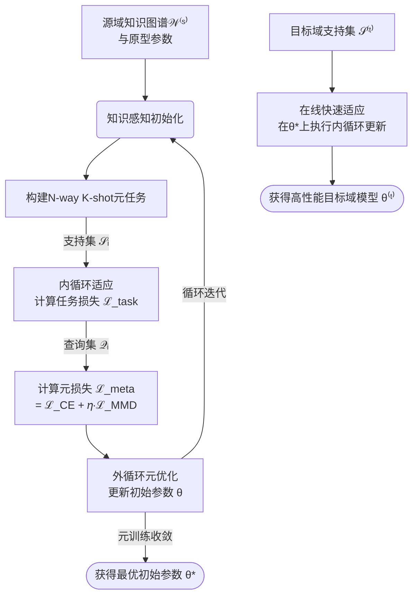

**第3部分：自适应元迁移学习（Adaptive Meta-Transfer Learning）** 进行彻底的完善。我们将严格规范所有变量和表达式，确保其与全文其他部分在数学和物理意义上的一致性，并为每一小节补充更详尽、更严谨的解释和论证。

---

### **3. Adaptive Meta-Transfer Learning（自适应元迁移学习）**

**核心问题与目标**：在目标域标签样本极度稀缺（$K$-Shot, $K \geq 1$）的挑战性场景下，如何实现高精度、高泛化能力的故障诊断。本节旨在设计一个元学习框架，其核心创新在于**将物理知识驱动的可解释性组件与基于优化的元学习相结合**，使模型获得“学会如何学习”的能力。该框架不仅在源域任务上表现优异，更重要的是其**初始状态（Initialization）** 和**内部结构（Architecture）** 被预先优化，从而能够通过极少的梯度更新步骤快速适应全新的、样本极少的目标任务。

该过程由三个核心组件构成：**3.1 知识感知初始化（Knowledge-Aware Initialization）**、**3.2 特征适应层（Feature Adaptation Layer）** 和**3.3 元学习更新机制（Meta-Learning Update Mechanism）**。

---

### **3.1 Knowledge-Aware Initialization (知识感知初始化)**

**目的与动机**：传统的元学习（如MAML）通常采用随机初始化，其收敛速度和最终性能严重依赖于大量元训练任务的“暴力”搜索。这对于计算资源受限的工业场景并不友好。本节的初始化策略旨在为元学习器提供一个**物理意义明确、接近最优的高起点**。其基本思想是：**在物理特性上相似的任务，其最优模型参数也应相近**。我们通过计算目标故障与源域故障的物理特性相似度，动态地融合多个预训练的“专家模型”（即原型网络参数），使得初始化参数 $\theta_0$ 已蕴含对目标任务的强先验知识，从而极大加速元训练收敛并提升少样本适应性能。

**输入**：
1.  **源域知识图谱矩阵** $\mathcal{W}^{(s)} = [\mathbf{w}_1^{(s)^T}; \mathbf{w}_2^{(s)^T}; ...; \mathbf{w}_{C^{(s)}}^{(s)^T}] \in \mathbb{R}^{C^{(s)} \times D}$：来自**第1.2节**的输出。其中 $\mathbf{w}_c^{(s)}$ 是第 $c$ 类源故障的特征权重向量，编码了该类故障的物理特征重要性分布。
2.  **目标故障特征向量** $\mathbf{w}^{(t)} \in \mathbb{R}^{D}$：从目标域的**极少支持集（Support Set）** 样本中，按照**第1.2节完全相同的特征重要性评估算法**计算得到的向量。它表征了目标任务的独特物理模式。
3.  **源域原型参数集** $\{\theta_c^{\text{(proto)}}\}_{c=1}^{C^{(s)}}$：一组预先在源域各故障类别（$c=1, ..., C^{(s)}$）的充足数据上独立训练好的、性能收敛的诊断模型参数。每个 $\theta_c^{\text{(proto)}}$ 可视为一个诊断第 $c$ 类故障的“专家模型”。

**输出**：
- 知识感知的初始化模型参数 $\theta_0$。

**算法细节与核心公式**：
初始化参数 $\theta_0$ 是各个“专家模型”参数的加权平均，权重 $\gamma_c$ 由目标故障与各个源故障类的**知识相似度（Knowledge Affinity）** 决定。

\[
\theta_0 = \sum_{c=1}^{C^{(s)}} \gamma_c \cdot \theta_c^{\text{(proto)}}
\]
\[
\gamma_c = \frac{\exp(-\lambda \cdot d(\mathbf{w}_c^{(s)}, \mathbf{w}^{(t)}))}{\sum_{j=1}^{C^{(s)}} \exp(-\lambda \cdot d(\mathbf{w}_j^{(s)}, \mathbf{w}^{(t)}))}
\]
\[
d(\mathbf{w}_c^{(s)}, \mathbf{w}^{(t)}) = \| \mathbf{w}_c^{(s)} - \mathbf{w}^{(t)} \|_2
\]

-   **相似度度量**：$d(\cdot, \cdot)$ 计算源故障类 $c$ 与目标故障类的特征权重向量之间的**欧氏距离（Euclidean Distance）**。距离越小，表示两者的物理特性（表现为特征重要性分布）越相似。
-   **权重计算**：通过一个Softmax函数将负距离（$-d$）转化为归一化的融合权重 $\gamma_c \in (0, 1)$，且满足 $\sum_{c=1}^{C^{(s)}} \gamma_c = 1$。超参数 $\lambda > 0$ 是一个温度系数，控制权重分布的尖锐程度；$\lambda$ 越大，与目标最相似的源类别权重越高，其他源类别的权重被抑制得越厉害。
-   **物理意义**：该公式体现了“近朱者赤”的思想。**与目标任务物理特性越相似的源任务，其“专家模型”对初始化的贡献越大**。例如，若目标故障的振动特性（由 $\mathbf{w}^{(t)}$ 刻画）与“内圈故障”的物理模式最相似，则“内圈故障专家”的参数 $\theta_{\text{inner}}^{\text{(proto)}}$ 在 $\theta_0$ 中占比最高。这为模型提供了一个极佳的、无需从零开始搜索的优化起点。

---

### **3.2 Feature Adaptation Layer (特征适应层)**

**目的与动机**：传统的深度特征提取器 $\phi(\cdot; \theta_{\text{feat}})$ 是一个黑箱，其生成的特征表示缺乏明确的物理指导。本节设计一个轻量级、可自适应调节的网络层，其核心作用是**在模型的前向传播过程中，建立从物理知识空间到深度特征空间的实时映射**。该层利用知识图谱中对应故障类的权重向量，对提取的深度特征进行**显式的、与物理知识挂钩的缩放（Scaling）和偏移（Shifting）**，从而动态地增强对当前分类任务重要的特征、抑制不重要的或无关的特征，实现更精细、更可解释的特征空间变换（Feature Space Transformation）。

**输入**：
1.  **原始深度特征** $\mathbf{h} = \phi(\mathbf{x}; \theta_{\text{feat}}) \in \mathbb{R}^{D'}$： 由主干网络（Backbone Network）提取到的高维特征表示。
2.  **故障类别索引** $y$： 当前样本 $\mathbf{x}$ 的故障标签（训练时）或模型预测的故障类别（推理时）。
3.  **知识图谱权重向量** $\mathbf{w}_y \in \mathbb{R}^{D}$： 从知识图谱 $\mathcal{W}$ 中查询得到的、对应于故障 $y$ 的特征权重向量。

**输出**：
- 经过物理知识调制后的适应特征表示 $\mathbf{h}' \in \mathbb{R}^{D'}$。

**网络结构与操作**：
该层的操作可定义为一种“知识引导的特征调制”（Knowledge-Guided Feature Modulation），其结构如下图所示，其计算公式为：

\[
\mathbf{h}' = \text{LayerNorm} \Big( \boldsymbol{\alpha}_y \odot \mathbf{h} + \boldsymbol{\beta}_y \Big)
\]
其中，
\[
\boldsymbol{\alpha}_y = \sigma(\mathbf{S} \cdot \mathbf{w}_y + \mathbf{s}_0), \quad \boldsymbol{\beta}_y = \mathbf{B} \cdot \mathbf{w}_y + \mathbf{b}_0
\]

-   **缩放因子（Scaling Factor）** $\boldsymbol{\alpha}_y$: 由一个线性变换层（权重矩阵 $\mathbf{S} \in \mathbb{R}^{D' \times D}$，偏置 $\mathbf{s}_0 \in \mathbb{R}^{D'}$）后接Sigmoid激活函数 $\sigma(\cdot)$ 产生。它将低维的物理知识向量 $\mathbf{w}_y$ 映射为与深度特征 $\mathbf{h}$ 维度相匹配的缩放向量，值域为(0,1)，作为特征重要性系数。
-   **偏移因子（Shifting Factor）** $\boldsymbol{\beta}_y$: 由另一个线性变换层（权重矩阵 $\mathbf{B} \in \mathbb{R}^{D' \times D}$，偏置 $\mathbf{b}_0 \in \mathbb{R}^{D'}$）产生，提供特征偏移。
-   **调制操作**：$\odot$ 表示逐元素相乘（Hadamard积）。重要性系数 $\boldsymbol{\alpha}_y$ 直接作用于对应的特征维度上进行**缩放**。这意味着，在知识图谱中被认为重要的原始特征（如某频段的幅值），其对应的深度特征维度会被放大。
-   **层归一化（LayerNorm）**：对调制后的特征进行归一化，稳定优化过程，防止特征尺度因缩放和偏移而发生剧烈变化。

**物理意义与作用**：此层在**数据驱动的深度特征空间**和**物理启发的知识空间**之间建立了一座可微的、可学习的桥梁。它允许模型在训练和推理的每一次前向计算中，根据当前样本最可能属于的故障类别，动态地调用该故障的物理先验知识，对深度特征进行“校准”或“聚焦”，使其更具判别性和可解释性。**它本质上是在教导网络如何更好地利用物理知识，而不仅仅是盲目地拟合数据。**

---

### **3.3 Meta-Learning Update (元学习更新机制)**

**目的与动机**：本小节采用基于优化的元学习（Model-Agnostic Meta-Learning, MAML）框架，在大量基于源域数据构建的少样本诊断任务上训练模型，**其终极目标是优化模型的初始化参数 $\theta_0$**，而非最终任务的性能。创新点在于：1) 引入了**3.1节的知识感知初始化**作为元学习的起点；2) 在模型结构中嵌入了**3.2节的特征适应层**；3) 在元目标（Meta-Objective）中引入了**分布对齐损失**， explicitly 约束模型学习到的特征空间本身具有良好的可迁移性和域不变性（Domain-Invariance），而不仅仅是学习一个快速过拟合的分类器。

**输入**：
- 增强后的源域数据集 $\mathcal{D}_{\text{aug}}$（来自**第2.4节**的输出），用于构建元训练任务。
- 包含特征适应层的诊断模型 $f_\theta$。
- （可选）目标域的一个小型无标签数据集 $\mathcal{D}^{(t)}_{\text{unlabeled}}$，用于计算分布对齐损失（若无，可从元任务查询集近似）。

**输出**：
- 最终优化后的模型初始化参数 $\theta^*$（即具备了强大快速适应能力的模型初始点）。

**元训练流程的数学表述**：
元训练过程旨在最小化所有元任务上的期望损失。其优化问题可表述为：

\[
\theta^* = \arg\min_{\theta} \mathbb{E}_{\mathcal{T}_i \sim p(\mathcal{T})} \left[ \mathcal{L}_{\mathcal{Q}_i}^{\text{meta}} (f_{\theta_i'}) \right]
\]
\[
\text{其中，} \quad \theta_i' = \theta - \alpha \nabla_{\theta} \mathcal{L}_{\mathcal{S}_i}^{\text{task}} (f_{\theta})
\]

1.  **任务分布（Task Distribution）**：$p(\mathcal{T})$ 代表元任务分布。每个任务 $\mathcal{T}_i$ 从 $\mathcal{D}_{\text{aug}}$ 中采样得到，包含支持集（Support Set）$\mathcal{S}_i$ 和查询集（Query Set）$\mathcal{Q}_i$，通常设置为 $N$-way $K$-shot 分类任务。

2.  **内循环（Inner-Loop） - 任务特定适应**：对于每个任务 $\mathcal{T}_i$，在支持集 $\mathcal{S}_i$ 上计算任务损失 $\mathcal{L}_{\mathcal{S}_i}^{\text{task}}$（如交叉熵损失），并对当前参数 $\theta$ 进行一步（或多步）梯度下降，得到适应后的任务特定参数 $\theta_i'$。步长 $\alpha$ 为内循环学习率。
    **注**：在此过程中，特征适应层根据样本的真实或预测标签 $y$ 实时调制特征，引导适应方向。

3.  **外循环（Outer-Loop） - 元优化**：在查询集 $\mathcal{Q}_i$ 上评估适应后的参数 $\theta_i'$ 的性能，计算元损失 $\mathcal{L}_{\mathcal{Q}_i}^{\text{meta}}$。然后，计算元损失关于初始参数 $\theta$ 的梯度，并更新 $\theta$：
    \[
    \theta \leftarrow \theta - \beta \nabla_{\theta} \sum_{\mathcal{T}_i} \mathcal{L}_{\mathcal{Q}_i}^{\text{meta}} (f_{\theta_i'})
    \]
    其中 $\beta$ 为外循环学习率。

4.  **元目标（Meta-Objective）**：元损失 $\mathcal{L}^{\text{meta}}$ 由两部分组成：
    \[
    \mathcal{L}_{\mathcal{Q}_i}^{\text{meta}} = \mathcal{L}_{\mathcal{Q}_i}^{\text{CE}} + \eta \cdot \mathcal{L}_{\mathcal{Q}_i}^{\text{MMD}}
    \]
    -   **任务损失（Task Loss）**：$\mathcal{L}_{\mathcal{Q}_i}^{\text{CE}}$ 为标准交叉熵损失，确保模型适应后的分类准确性。
    -   **分布对齐损失（Distribution Alignment Loss）**：$\mathcal{L}_{\mathcal{Q}_i}^{\text{MMD}}$ 为最大均值差异（Maximum Mean Discrepancy）损失，是确保可迁移性的关键。
        \[
        \mathcal{L}_{\mathcal{Q}_i}^{\text{MMD}} = \left\| \frac{1}{|\mathcal{Q}_i|} \sum_{\mathbf{x} \in \mathcal{Q}_i} \phi(\mathbf{x}; \theta_i') - \frac{1}{|\mathcal{D}^{(t)}_{\text{unlabeled}}|} \sum_{\mathbf{x} \in \mathcal{D}^{(t)}_{\text{unlabeled}}} \phi(\mathbf{x}; \theta_i') \right\|_{\mathcal{H}}^2
        \]
        此损失计算了当前任务查询集的特征分布与**目标域真实数据特征分布**之间的差异。最小化此损失迫使模型学习到的特征提取器 $\phi(\cdot)$ 能够产生**域不变的（Domain-Invariant）** 特征表示，即“忘记”特征来自哪个特定领域，只关注与故障相关的本质信息。超参数 $\eta$ 控制对齐项的强度。

**在线适应（Online Adaptation）**：
当元训练完成后，得到最优初始参数 $\theta^*$。对于全新的目标域故障诊断任务，只需利用其极少的支持集样本 $\mathcal{S}^{(t)}$，执行一到多步的内循环适应：
\[
\theta^{(t)} = \theta^* - \alpha \nabla_{\theta^*} \mathcal{L}_{\mathcal{S}^{(t)}}^{\text{task}} (f_{\theta^*})
\]
适应后的参数 $\theta^{(t)}$ 即可用于目标域的高精度诊断。整个自适应元迁移学习的过程如下图所示，其完整流程如下：

**总结**：本节提出的自适应元迁移学习框架，通过**知识感知初始化**提供了高起点，通过**特征适应层**实现了物理知识的实时注入，通过**融入MMD损失的元学习机制**确保了特征的可迁移性。三者协同作用，共同解决了极端少样本条件下的故障诊断难题，其核心思想是：**不仅要让模型学会如何学习，更要让它学会如何利用知识进行高效、可解释的学习。**