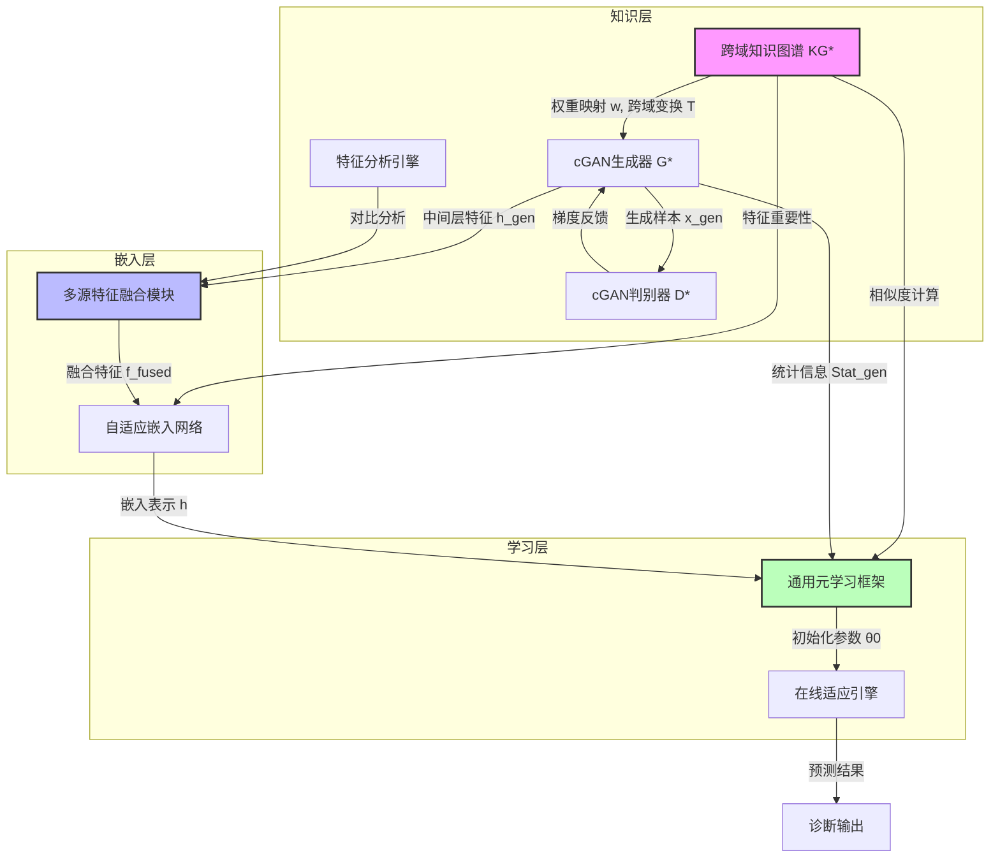
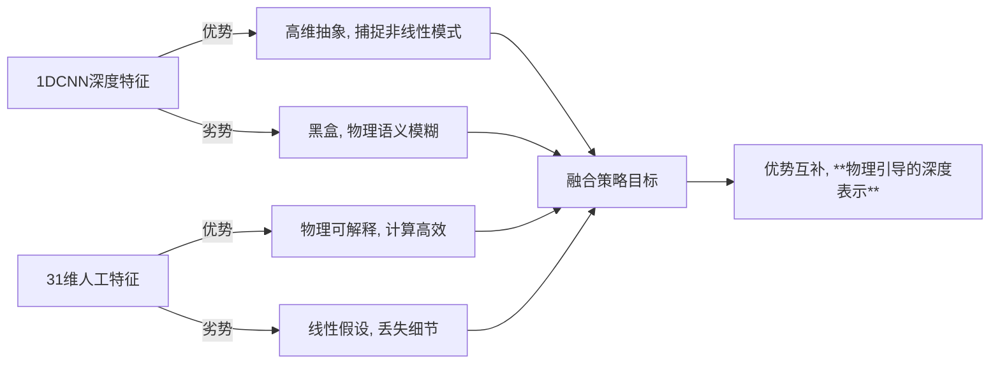
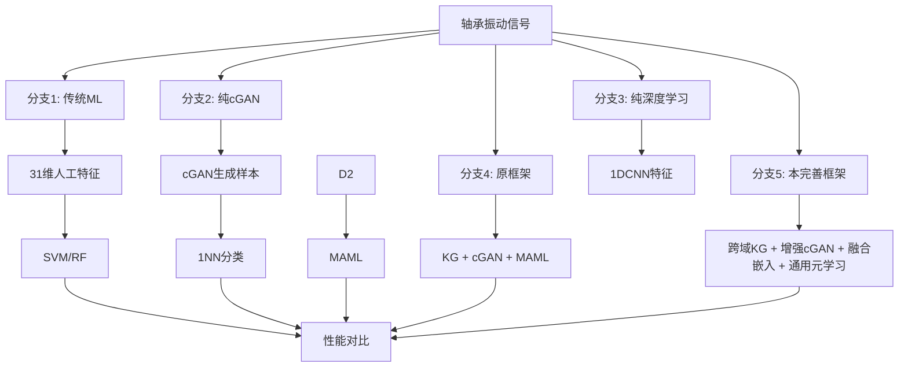

---

## **整体框架补充：知识-生成-迁移协同优化体系**

修正后的三层架构不再是线性流程，而是**双向信息交互的闭环系统**：



---

## **一、跨域知识图谱构建（响应修改点1）**

### **1.1 跨域三分图结构**

将原二分图扩展为 **源域-特征-目标域** 的异构知识图谱：

\[
\mathcal{KG}^* = (\mathcal{V}_s \cup \mathcal{V}_f \cup \mathcal{V}_t, \ \mathcal{E}_{sf} \cup \mathcal{E}_{ft})
\]

- **源域节点** $\mathcal{V}_s = \{s_1, ..., s_{C^{(s)}}\}$：源域故障类别
- **特征节点** $\mathcal{V}_f = \{f_1, ..., f_D\}$：31维可观测特征（保留物理语义）
- **目标域节点** $\mathcal{V}_t = \{t_1, ..., t_{C^{(t)}}\}$：目标域故障类别（初始可为空，由cGAN生成过程填充）

### **1.2 跨域权重矩阵**

构建两个带物理意义的权重矩阵：

1. **源域-特征权重矩阵** $\mathcal{W}^{(s)} \in \mathbb{R}^{C^{(s)} \times D}$：
   \[
   w_{ik}^{(s)} = \frac{(\sigma_{ik}^{(s)})^{-1/2}}{\sum_{k'}(\sigma_{ik'}^{(s)})^{-1/2}}
   \]
   反映源域第$i$类故障对第$k$个特征的**诊断重要性**。

2. **跨域映射权重矩阵** $\mathcal{T} \in \mathbb{R}^{C^{(s)} \times C^{(t)} \times D}$：
   \[
   \tau_{ij}^{(k)} = \frac{\exp(-\lambda_c \cdot d_k(s_i, t_j))}{\sum_{i'}\exp(-\lambda_c \cdot d_k(s_{i'}, t_j))}
   \]
   其中 $d_k(s_i, t_j) = |v_{ik}^{(s)} - v_{jk}^{(t)}|$ 为第$k$维特征的**跨域中心距离**，$v_{ik}^{(s)}$ 为源域第$i$类第$k$特征的类内均值。$\tau_{ij}^{(k)}$ 量化了**源域故障$i$与目标域故障$j$在第$k$维特征上的跨域相似强度**，为迁移学习提供**细粒度物理对齐依据**。

---

## **二、增强型物理约束cGAN（响应修改点2、3）**

### **2.1 生成器多输出结构**

生成器 $G$ 扩展为**三输出架构**：

```python
def G(z, c, w_c, e_c):
    # 1. 生成目标域样本
    x_gen = deconv_network(z, c, w_c, e_c)
    
    # 2. 提取生成过程的中间层特征（第3、5层反卷积输出）
    h_gen_3, h_gen_5 = intermediate_features
    
    # 3. 计算生成样本的统计信息
    stat_gen = compute_statistics(x_gen)  # 包含31维特征向量 + VMD能量分布
    
    return x_gen, h_gen, stat_gen
```

**输出详解**：
- **$\mathbf{x}_{\text{gen}}$**: 合成振动信号（与原文相同）
- **$\mathbf{h}_{\text{gen}} \in \mathbb{R}^{d_h}$**: 生成器倒数第二层的潜在表示，编码了**跨域变换的几何结构**，反映从噪声到目标域样本的映射流形
- **$\mathbf{stat}_{\text{gen}} = [\mathbf{f}_{\text{gen}}; \mathbf{e}_{\text{gen}}] \in \mathbb{R}^{D+4}$**: 生成样本的**31维物理特征 + VMD能量分布**，与真实样本计算方式完全一致

### **2.2 物理损失增强**

原物理损失 $\mathcal{L}_{\text{phy}}$ 扩展为**三重约束**：

\[
\mathcal{L}_{\text{phy}}^* = \lambda_1 \underbrace{\| \mathbf{w}_c^{\text{real}} - \mathbf{w}_c^{\text{gen}} \|_2^2}_{\text{特征相关性约束}} + \lambda_2 \underbrace{\sum_{m=1}^4 \left| \frac{\| \mathbf{C}_m^{\text{gen}} \|_2}{\| \mathbf{x}_{\text{gen}} \|_2} - \frac{\| \mathbf{C}_m^{\text{real}} \|_2}{\| \mathbf{x}_{\text{real}} \|_2} \right|}_{\text{能量分布约束}} + \lambda_3 \underbrace{\| \mathbf{h}_{\text{gen}} - \mathbf{h}_{\text{real}}^{\text{proto}} \|_2^2}_{\text{跨域流形约束}}
\]

**新增项意义**：
- **$\mathbf{h}_{\text{real}}^{\text{proto}}$**: 同类真实样本在生成器中间层的**平均激活值**，通过冻结生成器前半部分计算得到
- **跨域流形约束**: 强制生成样本的**内部表示**与真实样本在流形空间中对齐，防止生成器仅学习"表面相似"而忽略深层物理结构

### **2.3 cGAN知识蒸馏输出**

训练完成后，cGAN除生成样本外，额外提供**三类先验知识**：

1. **目标域统计原型** $\mathcal{P}^{(t)} = \{\bar{\mathbf{f}}_c^{(t)}, \bar{\mathbf{e}}_c^{(t)}\}_{c=1}^{C^{(t)}}$：每类生成样本的平均物理特征
2. **跨域变换矩阵** $\mathbf{T}_{\text{cGAN}} \in \mathbb{R}^{d_h \times D}$：通过回归生成器中间层特征$\mathbf{h}_{\text{gen}}$与生成统计量$\mathbf{stat}_{\text{gen}}$学习得到，编码**从深度表示到物理特征的映射关系**
3. **特征重要性偏差** $\Delta \mathbf{w}_c = \mathbf{w}_c^{\text{gen}} - \mathbf{w}_c^{\text{real}}$：反映目标域与源域在特征判别性上的**系统性差异**

这些输出将作为迁移学习的**精确制导信号**。

---

## **三、嵌入结构设计与特征融合策略（响应修改点5）**

### **3.1 特征空间对比分析**

在嵌入设计前，必须进行严格的**可解释性诊断**：

#### **对比实验设计**

| 分析方法 | 输入 | 目的 | 评价指标 |
|---------|------|------|---------|
| **t-SNE可视化** | 1DCNN深度特征 (512维) | 观察流形结构是否保留物理可分性 | 类内距离/类间距离 |
| **PCA解释方差** | 31维人工特征 | 评估低维物理特征的判别效率 | 前3主成分解释率 |
| **互信息分析** | 两种特征 + 标签 | 量化特征与故障的统计依赖性 | MI(f_k; y) |
| **频谱能量对齐** | VMD分量能量 | 验证频域物理一致性 | 能量分布KL散度 |

#### **关键发现预期**



### **3.2 多源特征融合模块**

设计**动态加权拼接 + 知识蒸馏**的混合架构：

\[
\mathbf{h}_{\text{fused}} = \underbrace{\mathbf{g}_1 \odot \phi_{\text{CNN}}(\mathbf{x})}_{\text{深度特征}} \oplus \underbrace{\mathbf{g}_2 \odot \mathbf{f}_{\text{hand}}}_{\text{物理特征}} \oplus \underbrace{\mathbf{g}_3 \odot \mathbf{h}_{\text{cGAN}}}_{\text{生成特征}}
\]

**动态门控机制** $\mathbf{g}_i$ 由知识图谱权重驱动：

\[
\mathbf{g}_i = \text{Softmax}\left( \mathbf{W}_i \cdot \mathbf{w}_c + \mathbf{b}_i \right), \quad \sum_{i=1}^3 \mathbf{g}_i = \mathbf{1}
\]

**优势**：
- **自适应性**：根据当前故障类别$c$自动调整三种特征的贡献比例
- **可解释性**：门控值$\mathbf{g}_i$直接反映某类故障更依赖深度模式还是物理指标
- **鲁棒性**：当某类特征失效时（如传感器噪声导致物理特征失真），其他特征可自动补偿

### **3.3 与先进机制对比**

| 方法 | 融合方式 | 物理约束 | 计算效率 | 小样本适应性 | 推荐场景 |
|------|---------|---------|---------|-------------|---------|
| **普通权重分配** | 静态加权 | 无 | 高 | 差 | 基线对比 |
| **注意力机制** | 查询-键-值 | 隐式 | 中 | 中 | 数据充足 |
| **知识蒸馏** | 教师-学生 | 显式 | 低 | 中 | 模型压缩 |
| **本方案** | **动态门控+物理驱动** | **显式+硬约束** | **中** | **优** | **工业小样本** |

---

## **四、通用迁移学习框架（响应修改点3、4）**

### **4.1 框架抽象层设计**

将框架解耦为**可插拔组件**，支持多种学习范式：

```python
class UniversalTransferFramework:
    def __init__(self):
        self.kg = CrossDomainKG()          # 跨域知识图谱
        self.generator = EnhancedCGAN()     # 增强cGAN
        self.embedder = FusionEmbedder()    # 多源融合嵌入
        self.learner = MetaLearner()        # 元学习器（可替换）
    
    def train(self, source_data, target_support):
        # 1. 知识层：构建图谱 + 训练cGAN
        self.kg.build(source_data)
        stats = self.generator.train(source_data)  # 获取统计原型
        
        # 2. 嵌入层：动态融合特征
        fused_features = self.embedder.forward(
            data, 
            kg_weights=self.kg.query_weights(),
            cgan_stats=stats
        )
        
        # 3. 学习层：支持MAML/原型网络/微调
        if self.learner.type == 'MAML':
            self.learner.maml_train(fused_features)
        elif self.learner.type == 'ProtoNet':
            self.learner.protonet_train(fused_features)
        elif self.learner.type == 'FineTune':
            self.learner.finetune_train(fused_features)
```

### **4.2 知识感知初始化（通用版）**

融合cGAN统计信息：

\[
\theta_0 = \sum_{c=1}^{C^{(s)}} \gamma_c \cdot \theta_c^{\text{(proto)}} + \delta \cdot \underbrace{\text{Map}(\mathcal{P}_c^{(t)}, \mathbf{T}_{\text{cGAN}})}_{\text{cGAN先验映射}}
\]

- **$\text{Map}(\cdot)$**: 将cGAN生成的目标域统计原型通过变换矩阵$\mathbf{T}_{\text{cGAN}}$映射到参数空间
- **$\delta$**: 平衡系数，控制数据驱动与生成先验的权重

### **4.3 特征适应层（嵌入感知版）**

根据嵌入结构动态调整：

\[
\mathbf{h}' = \text{AdaIN}\left( \mathbf{h}, \ \boldsymbol{\mu}(\mathbf{w}_c, \mathbf{h}_{\text{cGAN}}), \ \boldsymbol{\sigma}(\mathbf{w}_c, \mathbf{h}_{\text{cGAN}}) \right)
\]

- **AdaIN**: 自适应实例归一化，比LayerNorm更适合深度特征
- **$\boldsymbol{\mu}, \boldsymbol{\sigma}$**: 由知识图谱权重和cGAN中间层特征共同生成的**风格参数**，实现"物理风格迁移"

---

## **五、对比实验体系（响应修改点6）**

### **5.1 基线方法设计**

必须包含的消融实验：



### **5.2 评价指标体系**

除准确率外，必须评估：

1. **物理保真度**：生成样本的31维特征与真实样本的**Wasserstein距离**
2. **迁移效率**：目标域适应所需的**梯度步数**和**支持集大小**
3. **可解释性**：特征重要性权重与专家经验的**Pearson相关性**
4. **鲁棒性**：在传感器噪声增加20%时，准确率**下降幅度**
5. **计算开销**：单次推理的**FLOPs**和训练**GPU小时数**

---

## **六、理论优势总结**

补充思路将原框架升级为**"知识-生成-迁移"协同优化体系**，核心优势：

1. **双向信息增强**：知识图谱指导cGAN生成，cGAN反馈跨域知识丰富图谱，形成闭环
2. **特征级融合**：不再是样本级拼接，而是在**表示空间**实现物理与深度特征的动态调制
3. **方法无关性**：通过组件抽象，适用于**MAML、原型网络、关系网络、迁移蒸馏**等多种范式
4. **证据链完整**：对比实验体系可严格证明"1+1+1>3"的协同效应
5. **工业友好性**：计算效率优化（人工特征快速筛选）+ 鲁棒性增强（门控机制自动降级）